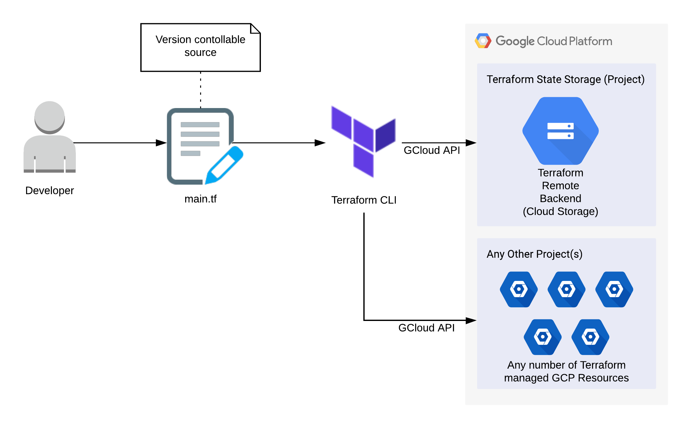

# Terraform GCP Remote Backend

Cloud Infrastructure as Code: Provisioning a Terraform Remote Backend in GCP.

## Features

<p align="center"><a href="https://cloud.google.com/"></a><a href="https://www.terraform.io/"></a></p>

 - This project builds upon the [infrastructure-terraform-gcp-intro](https://github.com/inventive-technology/infrastructure-terraform-gcp-intro) project and provisions a simple storage bucket in Google Cloud Platform that can be used by Terraform as a remote backend.
 
 - Terraform maintains state information locally by default, however Terraform's [remote backend](https://www.terraform.io/docs/language/settings/backends/remote.html) stores state information for provisioned projects remotely in a cloud environment. This means that there is no dependency on local terminals for the state information used by the *terraform plan* and *terraform apply* operations.

 - Terraform projects can be configured to use one remote backend per GCP project, or one remote backend across many GCP projects. This example uses one remote backend for all projects. An advantage of this approach is simple and centralised configuration.

 - Once the storage bucket has been provisioned, any other Terraform project can reference it as a remote backend in their Terraform config (provided they also have a service-user key for this project). See [infrastructure-terraform-gcp-storage](https://github.com/inventive-technology/infrastructure-terraform-gcp-storage) for example.

<p align="center"></p>

## Prerequisites

 - An installation of [Terraform CLI](https://learn.hashicorp.com/tutorials/terraform/install-cli)
 - A Google Cloud Platform account and installation of [Google Cloud SDK](https://cloud.google.com/sdk/docs/install)

## Getting Started

 - Log into Google Cloud Platform create a new project and *copy* the project ID.
 
 - Edit the [main.tf](main.tf) and *paste* your project ID into the **project** line:

```
  project     = "place-project-id-here"
```

 - Within your GCP account for the selected project, under *IAM & Admin* find the *Service Accounts* section and create a GCP service account with the "Editor" priviledge. Export a json key for the service account and save it in the root of this project. See the [infrastructure-terraform-gcp-intro](https://github.com/inventive-technology/infrastructure-terraform-gcp-intro) project for detailed instructions.
 
 - Edit the [main.tf](main.tf) file and insert the file name of the exported json file into the **credentials** line, for example:

```
  credentials = file("my-project-key.json")
```

 - At the command line, in the root of this project you will need to initialise Terraform:

```
terraform init
```

 - You can then validate that the syntax of the Terraform configuration is correct by running:

```
terraform validate
```

 - To see what changes Terraform will need to apply, run:

```
terraform plan
```
 - Now we are ready to deploy the infrastructure, you will need to confirm with 'yes' when prompted:

```
terraform apply
```
 - The storage bucket for Terraform's remote backend should now exist within your Google Cloud Platform account.


 - The remote backend (storage bucket) created in this project can be referenced by configuring other projects to use the bucket id created in this project. Any projects using this remote backend must reference the json service user key exported above, for example:

```
terraform {
  backend "gcs" {
    bucket      = "terraform-state-storage-xxxxxxxxxxxxxxxx"
    prefix      = "storage"
    credentials = "keys/terraform-state-storage-xxxxxx-xxxxxxxxxxxx.json"
  }
}
```

 - See [infrastructure-terraform-gcp-storage](https://github.com/inventive-technology/infrastructure-terraform-gcp-storage) for an example of a project that consumes this remote backend.

## Usage

```bash
terraform init
terraform validate
terraform plan
terraform apply
terraform destroy
```

## Contributing
If you have any feedback/ideas open an issue and tell me what you think.

## References/Related Projects
 - [https://terraform.io](https://terraform.io)
 - [https://www.terraform.io/docs/language/settings/backends/remote.html](https://www.terraform.io/docs/language/settings/backends/remote.html)
 - [https://cloud.google.com](https://cloud.google.com)
 - [https://github.com/inventive-technology/infrastructure-terraform-gcp-intro](https://github.com/inventive-technology/infrastructure-terraform-gcp-intro) - a basic introduction to Terraform/GCP
 - [https://github.com/inventive-technology/infrastructure-terraform-gcp-storage](https://github.com/inventive-technology/infrastructure-terraform-gcp-storage) - a project that makes use of this remote backend